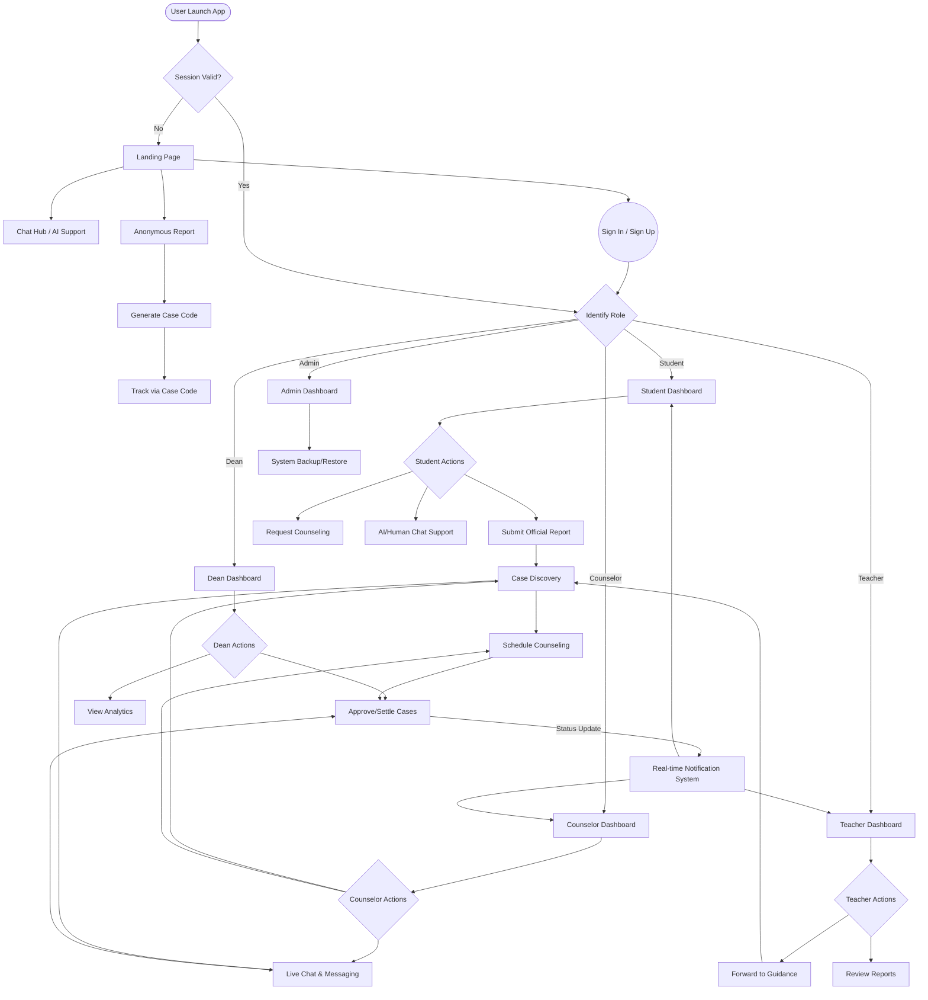

# FCU Guidance Management System - Master Flowchart

This diagram consolidates all major modules and user interactions into a single unified workspace flow.

## How to Read This Flowchart
- **Rectangles:** Pages or Modules.
- **Diamonds:** Decision points or Role checks.
- **Ovals:** Start and End points.
- **Multiple Arrows:** Parallel actions or branching logic.
- **Notifications:** The background process that keeps all status updates synced in real-time.
